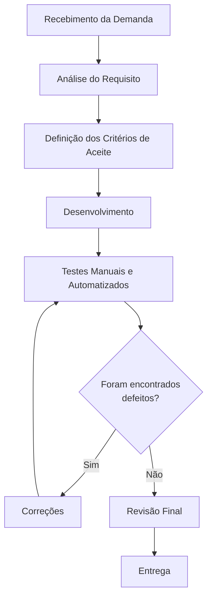

# Aula 14 - Qualidade de Processo

## 👥 Integrantes
- Matheus Rohrig - 071900826

## 1. Mapeamento do Processo Atual

### Fluxograma do Processo

```text
     Recebimento da Demanda
             ↓
       Desenvolvimento
             ↓
Testes Manuais e Automatizados
             ↓
         Correções
             ↓       
       Revisão Final       
             ↓
          Entrega

```



### Descrição do Fluxo

1. **Recebimento da demanda** – o enunciado da aula do PBL é lido, indicando qual funcionalidade do LocalEats será trabalhada (ex.: visualização de cardápio, cálculo de taxa de entrega, navegação entre páginas).
2. **Análise do requisito** – a funcionalidade do sistema é explorada diretamente no LocalEats para entender a regra de negócio e o comportamento esperado.
3. **Definição dos critérios de aceite** – definição do que precisa ser validado para considerar a funcionalidade corretamente testada (ex.: valores de taxa de entrega esperados, cenários de cardápio vazio/preenchido, rotas de navegação obrigatórias).
4. **Desenvolvimento** – criação dos artefatos de teste sobre a funcionalidade analisada: cenários Gherkin (BDD), testes unitários em Python com pytest (TDD), ou scripts Playwright com Page Object Model.
5. **Testes manuais e automatizados** – os testes são rodados contra a funcionalidade real do LocalEats.
6. **Correções** – se um teste falha ou revela um defeito na funcionalidade, o cenário/teste é ajustado e a execução é repetida.
7. **Revisão final** – conferência se a funcionalidade corrigida atende de fato aos critérios de aceite definidos anteriormente.
8. **Entrega** – os testes validados e a documentação da funcionalidade são organizados e enviados ao repositório GitHub.

## 2. Identificação de Entradas, Atividades e Saídas

| Etapa | Entrada | Atividade | Saída |
|---|---|---|---|
| Recebimento da demanda | Enunciado da aula (ex.: "testar cálculo da taxa de entrega") | Registrar e entender qual funcionalidade do LocalEats precisa ser validada | Funcionalidade-alvo definida |
| Análise do requisito | Funcionalidade-alvo (ex.: cardápio, taxa de entrega, navegação) | Explorar a funcionalidade no LocalEats e entender a regra de negócio esperada | Comportamento esperado documentado |
| Definição dos critérios de aceite | Comportamento esperado | Definir o que precisa ser validado para considerar a funcionalidade corretamente testada | Critérios de aceite definidos |
| Desenvolvimento | Comportamento esperado e critérios de aceite | Criação de testes unitários (pytest), cenários BDD (Gherkin) ou automação (Playwright/POM) | Artefato de teste implementado |
| Testes manuais e automatizados | Artefato de teste + funcionalidade no LocalEats | Rodar os testes manuais/automatizados sobre a funcionalidade | Evidências de execução e eventuais defeitos |
| Correções | Defeito ou falha identificada | Ajuste do teste, do cenário ou correção da regra validada | Funcionalidade e teste corrigidos |
| Revisão final | Funcionalidade e teste corrigidos | Conferir se a entrega atende aos critérios de aceite definidos | Funcionalidade aprovada |
| Entrega | Funcionalidade aprovada | Documentação e commit no repositório GitHub | Atividade da funcionalidade entregue |

## 3. Reflexão sobre o Processo

### 1. O processo utilizado está claramente definido?
Parcialmente. Existe uma sequência lógica que se repete a cada atividade (receber → analisar → desenvolver → testar → corrigir → entregar), mas ela nunca foi formalmente documentada antes desta aula — era seguida "de cabeça", por hábito, e não como um processo escrito e padronizado.

### 2. Todos os integrantes seguem o mesmo fluxo de trabalho?
Como o trabalho foi realizado individualmente, não há variação entre integrantes. Isso elimina um risco comum de equipes maiores (falta de padronização entre pessoas), mas também significa que não há revisão cruzada (par de olhos externo) antes da entrega.

### 3. Em quais etapas a qualidade é verificada?
Principalmente na etapa de **Testes Manuais e Automatizados**, onde o comportamento real da funcionalidade é confrontado com o esperado — por exemplo, conferir se a taxa de entrega calculada pelo pytest bate com a regra de negócio, se o cardápio exibido no LocalEats corresponde ao cenário BDD escrito, ou se a navegação entre páginas automatizada com Playwright segue o fluxo definido. Há também verificação nas etapas de **Correções** (reavaliação após ajuste) e **Revisão Final**, onde se confere se a funcionalidade realmente atende aos critérios de aceite definidos antes da entrega.

### 4. Quais melhorias poderiam tornar o processo mais eficiente?
- Formalizar o processo em um checklist reutilizável para cada nova atividade do PBL.
- Adicionar uma etapa explícita de **revisão** (mesmo que autorrevisão com base em critérios como a rubrica Unisenac) antes da entrega final.
- Automatizar mais verificações (ex.: rodar testes automaticamente antes de cada commit).
- Registrar decisões técnicas tomadas durante o desenvolvimento, facilitando rastreabilidade em atividades futuras.

### 5. Como a qualidade do processo impacta a qualidade do produto final?
Um processo bem definido reduz a chance de etapas serem puladas (como testar antes de entregar) e torna os resultados mais consistentes entre atividades. Quando o processo depende só da memória e do hábito, existe risco de inconsistência entre uma entrega e outra. Formalizar o fluxo, mesmo trabalhando sozinho, ajuda a manter um padrão de qualidade repetível — o que é exatamente o princípio por trás de normas como a ISO/IEC 25010, já trabalhada em atividades anteriores do PBL.
